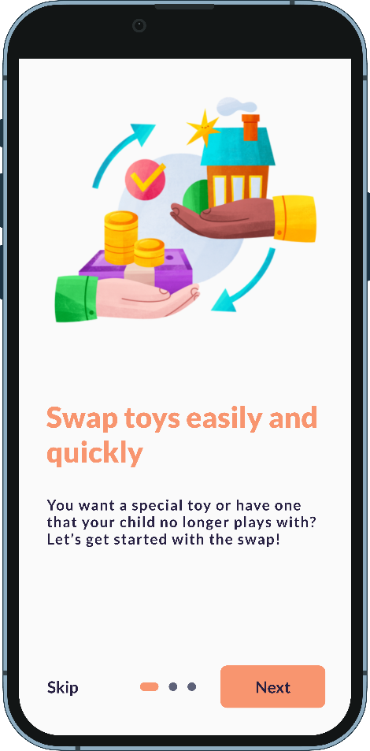
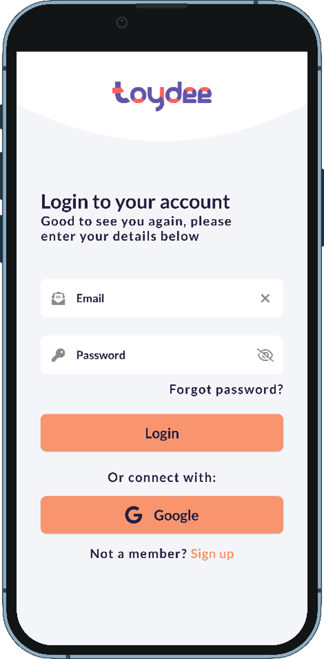
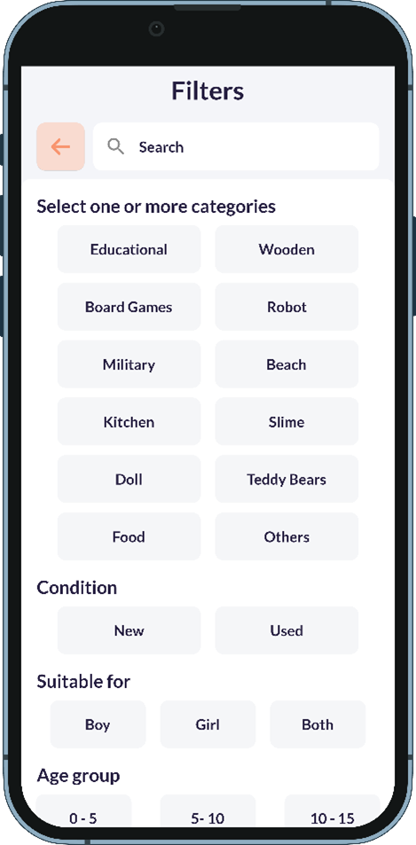
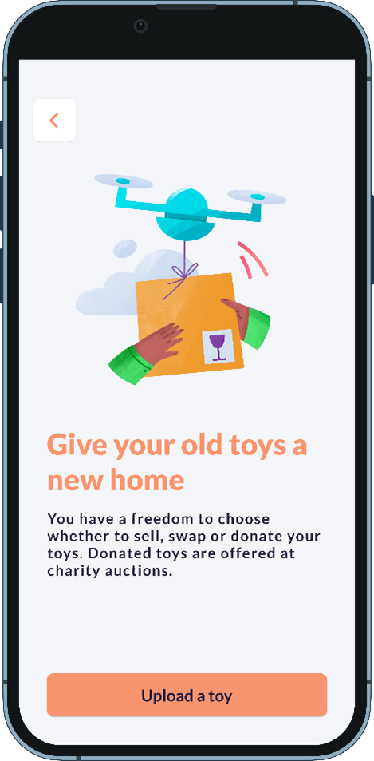
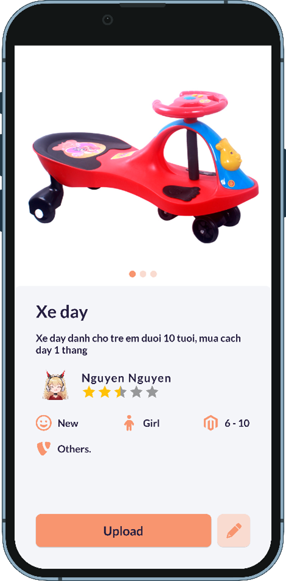
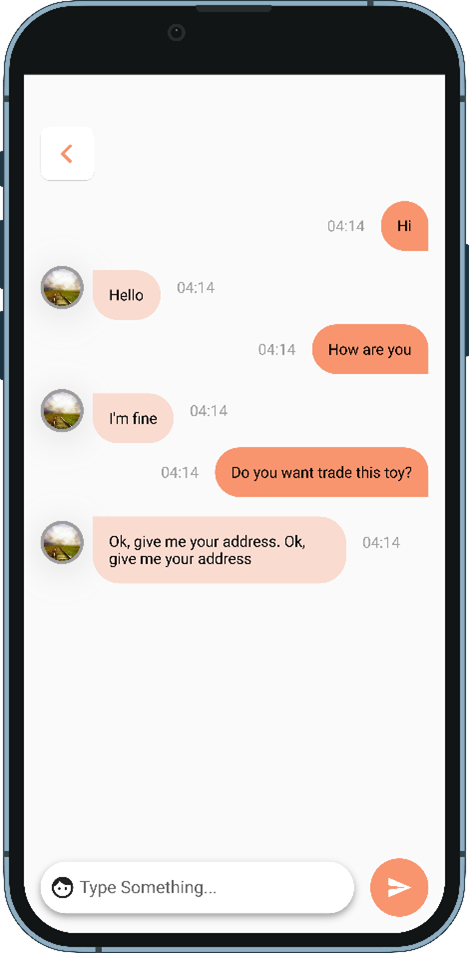

# Toy Exchange Application

## Table of Contents
* [Introduction](#introduction)
* [Technologies Used](#technologies-used)
* [Features](#features)
* [How to install and run the project](#how-to-install-and-run-the-project)
* [Acknowledgements](#acknowledgements)

## Introduction
- There are kids asking for a new toy every day, but surely within a day or a week, you can find that toy in a corner of your house. 
- Children love to play with toys but get bored very quickly if they play with the same toy all the time. Causing parents to buy new toys to replace old ones. 
- To overcome this problem, the Toydee application was born to allow users to exchange toys with each other

This is the [Report](https://drive.google.com/file/d/1vN2MT3g5AQ9TS09GGMVaU2NULDNCrtQP/view?usp=sharing)

     
    
    
    
    
    

## Technologies Used
**Toy Exchange Application** should use the following technologies, frameworks and development techniques:

- [Android Studio](https://developer.android.com/studio) 
- [Firebase](https://firebase.google.com/) 
- [Flutter SDK](https://flutter.dev/) 
- [Dart language](https://dart.dev/) 
- [Riverpod](https://riverpod.dev/) 

## Features
A few of the things you can do with **Toy Exchange Application**:
- Log in
- Sign up
- List of toy
- Toy detail
- Search and filter
- Swap toy
- Post new toys
- Create events
- Donate toys for events
- Chatting
- Profile and setting

## How to install and run the project
To clone (dev branch) and run this application, you'll need [Visual Studio Code](https://code.visualstudio.com/) installed on your computer.  
Open terminal  
`Flutter clean ` in Visual Studio Code  
`Flutter pub get ` in Visual Studio Code  
`Flutter run ` in Visual Studio Code  

## Acknowledgements
- [Android Studio](https://developer.android.com/studio)   
- [Stackoverflow](https://stackoverflow.com/)  
- [Github](https://github.com/)  
- [Firebase](https://firebase.google.com/)   
- [Flutter SDK](https://flutter.dev/)   
- [Dart language](https://dart.dev/)   
- [Riverpod](https://riverpod.dev/)   

## Development Team
- [Lu Xuan Thai](https://github.com/xuanthai2)
- [Nguyen Duc Thanh Phat](https://github.com/thanhphat219)

